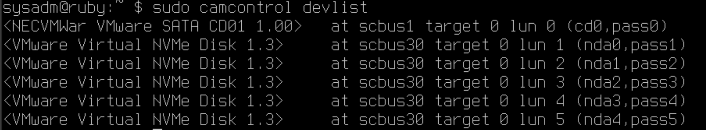

# SA - hw
### file server
```
$ sudo chown sysadm:sftp /home/sftp/public
$ sudo chown sysadm:sftp /home/sftp/hidden
$ sudo chmod 3775 /home/sftp/public
$ sudo chmod 771 /home/sftp/hidden
```


### add new hard disks & raid10 pool, zfs service and datasets
1. create new hard disk: vm shutdown -> add new hard disk
2. check your disks:
```
$ sudo camcontrol devlist
```


3. create gpt partition scheme and label them:
repeat this on the four disks (i = 1~4)
```
$ sudo gpart create -s gpt nda{i}
$ sudo gpart add -t freebsd-zfs -l mypool-{i} nda{i}
```
#### debug
```
$ lsblk
$ sudo diskinfo -c nda1 # check sector size
$ sudo gpart show nda1 # check partition size
```
4. enable gptid (kernel option)
a. in /boot/loader.conf file: change
```
kern.geom.label.gptid.enable="1"
```
or b. (for current session, gone after rebooting)
```
sudo sysctl kern.geom.label.gptid.enable=1
```
5. initialize zfs pool using vdev with gpt label
```
sudo zpool create mypool mirror /dev/gpt/mypool-1 /dev/gpt/mypool-2 mirror /dev/gpt/mypool-3 /dev/gpt/mypool-4
```
#### debug
```
$ zpool status mypool
```
6. mount
```
zfs set mountpoint=/home/sftp mypool
```
7. create ZFS datasets
```
# create dataset
sudo zfs create mypool/public
sudo zfs create mypool/hidden

# set compress-lz4, atime=off
sudo zfs set compression=lz4 atime=off mypool
sudo zfs set compression=lz4 atime=off mypool/public
sudo zfs set compression=lz4 atime=off mypool/hidden
```

8. automatic snapshoot script: zfsbak