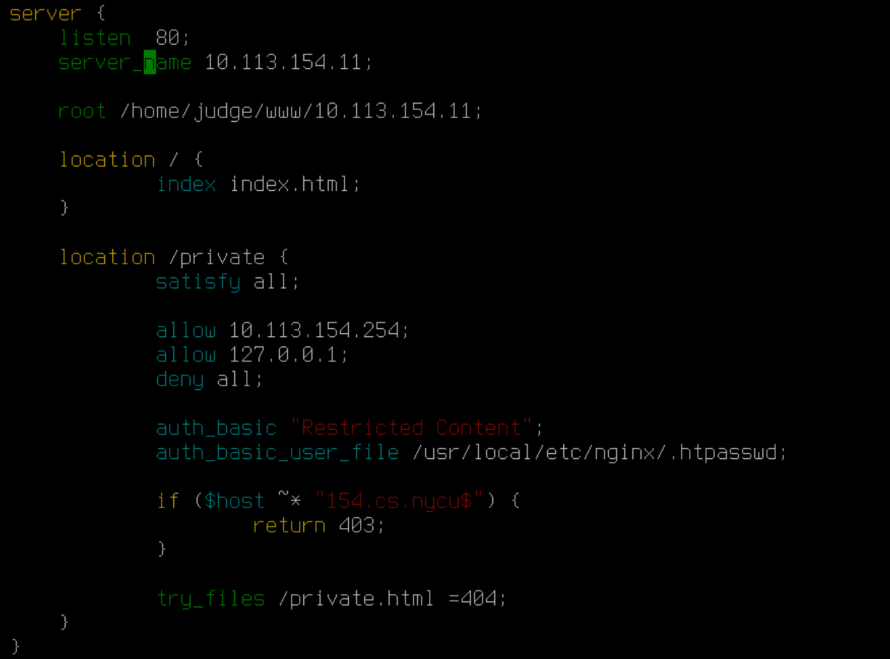

4
For this assignment, at first, I tried to use `Caddy` to setup the server(refered to the slides). But after reading to many documents and discussion, I find it impossible to achieve all the logging and log rotate requirements thru Caddy. (Serve as a small suggestion for the T.A.s)

## HTTP Server
### Virtual Hosts
#### 1. install and enable nginx

```bash!
$ sudo pkg install nginx
$ service nginx enable
```

#### 2. add the following path to the file: `/usr/local/etc/nginx/nginx.conf`




#### 3. edit the hosts file `/etc/hosts` to map the domain name to your IP address
```bash!
10.113.{ID}.11    {ID}.cs.nycu
````

#### 4. start Nginx
```bash!
$ service nginx start
```

#### 5. mkdir & add index files


- `/home/judge/www/{ID}.cs.nycu/index.html`
> Content: 2023-nycu.sa-hw4-vhost

- `/home/judge/www/10.113.{ID}.11/index.html`
> Content: 2023-nycu.sa-hw4-ip
    
#### DEBUG
```bash!
curl {ID}.cs.nycu
```
set current time
```
sudo ntpdate -u 0.pool.ntp.org
```

### Logging (6%) && Log Rotate (6%)

1. edit `/usr/local/etc/nginx/nginx.conf`
```
http {
    ...

    log_format agent '$remote_addr | $request | $http_user_agent is my Agent Info.';

    ...

    access_log /home/judge/log/access.log combined;
    access_log /home/judge/log/compressed.log.gz agent;
    
    server {
        listen 80;
        server_name 10.113.{ID}.11;

        ...
    }
}
```

2. test: 
```bash
sudo nginx -t
curl 10.113.{ID}.11
# and then check the output in the log file.
```

3. insatll `logrotate`

```
sudo pkg install logrotate
```

4. configure log rotation: edit `/home/judge/log/judge-rotate.conf`
```bash
/home/judge/log/access.log {
    su www www
    size 150
    rotate 3
    compress
    notifempty
    create 644 www wheel
    postrotate
        /usr/sbin/service nginx reload > /dev/null 2>&1 || true
        # killall nginx first, and start service nginx
    endscript
}
```
>Here's what each field means: 
- size 150 means logrotate will only rotate the log when it is larger than 150 bytes.
- rotate 3 specifies that logrotate should keep only the last three rotated log files.
- compress will gzip the rotated log files.
- notifempty instructs logrotate not to rotate the log file if it's empty.
- create 644 judge judge sets the permissions of new log files to 644 and changes the owner to judge and the group to judge.
- The postrotate script reloads Nginx without producing any output or error messages. If the reload fails, the || true part ensures that logrotate does not consider it a failure.

```
$ sudo chmod 644 /home/judge/log/judge-rotate.conf
```

5. restart nginx
```
sudo service nginx restart
```

6. test 

```
sudo logrotate --debug /home/judge/log/judge-rotate.conf

sudo logrotate /path/to/judge-rotate.conf
```

### HTTPS & HTTP2
1. Map ip 10.113.200.1 to domain ca.nasa.nycu (`/etc/hosts`)
```
10.113.200.1    ca.nasa.nycu
```
2. using acme.sh to get certificate from our CA server

* download acme
```
curl https://get.acme.sh | sh
```
* get certificate at **`/root/.acme.sh`** (rootca.pem provided by slide)
```bash
sudo pkg install socat
sudo ./acme.sh --issue --server https://ca.nasa.nycu:9000/acme/acme/directory -d {ID}.cs.nycu --standalone --force --ca-bundle /path/to/rootca.pem

# debug: if you meet error: {ID}.cs.nycu:Timeout
# run: $ sockstat -4 -6 | grep :80
# and then kill the process ($ sudo kill {PID})
```

3. Move the certificates to a directory that the web server can access.
```
sudo mv /root/.acme.sh/{ID}.cs.nycu_ecc/{ID}.cs.nycu.cer /etc/ssl/
sudo mv /root/.acme.sh/{ID}.cs.nycu_ecc/{ID}.cs.nycu.key /etc/ssl/
sudo mv /root/.acme.sh/{ID}.cs.nycu_ecc/ca.cer /etc/ssl/
sudo mv /root/.acme.sh/{ID}.cs.nycu_ecc/fullchain.cer /etc/ssl/

```
4. Change the permissions
```
sudo chmod 600 /etc/ssl/155.cs.nycu.key
sudo chmod 644 /etc/ssl/155.cs.nycu.cer
sudo chmod 644 /etc/ssl/ca.cer
sudo chmod 644 /etc/ssl/fullchain.cer
```
5. add ssl certificate to `nginx.conf`

```
server {
    listen 80;
    server_name {ID}.cs.nycu;

    ssl_certificate "/etc/ssl/fullchain.cer";
    ssl_certificate_key "/etc/ssl/{ID}.cs.nycu.key";
}

```

6. edit `nginx.conf`
- Redirect All HTTP Requests to HTTPS. Create a server block that listens on port 80 for HTTP traffic and redirects all requests to HTTPS:
- Enable HSTS
- Ensure HTTP/2 is Enabled, you need to add the http2 parameter to the listen directive for SSL:

**Here’s how your updated Nginx configuration should look**
```
# HTTP server block to handle redirection to HTTPS
server {
    listen 80;
    server_name {ID}.cs.nycu;
    return 301 https://$server_name$request_uri;
}

# HTTPS server block to handle secure requests
server {
    listen 443 ssl http2;
    server_name {ID}.cs.nycu;

    ssl_certificate "/etc/ssl/fullchain.cer";
    ssl_certificate_key "/etc/ssl/155.cs.nycu.key";

    # Enable HSTS
    add_header Strict-Transport-Security "max-age=31536000; includeSubDomains" always;

    server_tokens off;

    location / {
        root /home/judge/www/{ID}.cs.nycu;
        index index.html;
    }

    # Other configurations like location blocks...
}
```
#### DEBUG
- check if the output is "verify return code: 0(ok)"
```
openssl s_client -connect ca.nasa.nycu:9000 -CAfile /usr/local/share/certs/rootca.pem
```
- set current time
```
sudo ntpdate -u 0.pool.ntp.org
```

### Hide Server Information
edit `/usr/local/etc/nginx/nginx.conf`, add `server_tokens off;`
```
server {
    listen 80;
    server_name {ID}.cs.nycu;
    # hide info
    server_tokens off;
    ...
}

server {
    listen 443;
    server_name {ID}.cs.nycu;
    # hide info
    server_tokens off;
    ...
}
```
### Access Control
1. create a password file
```bash
sudo pkg install apache24
sudo htpasswd -c /usr/local/etc/nginx/.htpasswd sa-admin
# Username: sa-admin
# Password: Your {IP} without dots. (e.g. 101132011)
```
> after http3 part, need to change the path of `htpasswd`
2. edit `nginx.conf`:
```
server {
    listen 80;
    server_name 10.113.155.11;

    root /home/judge/www/10.113.155.11;

    location / {
        index index.html;
    }

    location /private {
        satisfy all;

        allow 10.113.155.254;
        allow 127.0.0.1;
        deny all;

        auth_basic "Restricted Content";
        auth_basic_user_file /usr/local/etc/nginx/.htpasswd;

        if ($host ~* "155.cs.nycu$") {
            return 403;
        }

        try_files /private.html =404;
    }
}
```

3. add html files
```bash
sudo vim /home/judge/www/10.113.{ID}.11/private.html
# Content: nycu-sa-hw4-private
sudo chmod 644 /home/judge/www/10.113.{ID}.11/private.html
```

4. check
```
curl -kLv -u sa-admin:10113{ID}11 --interface 127.0.0.1 http://10.113.{ID}.11/private
```

### PHP / PHP-FPM
1. Create a file named `info-{ID}.php`

```
<?php
phpinfo();
?>
```

2. Install PHP 8.2 or Higher
```
sudo pkg install php82
```

3. To hide the PHP version information from the HTTP response headers, modify the `php.ini` file:
    
> The php.ini file is typically located in `/usr/local/etc/php/`

```
expose_php = Off
```
4. Configure the Nginx Server Block
```
root /home/judge/{ID}.cs.nycu;

location ~ \.php$ {
    fastcgi_pass 127.0.0.1:9000; # or the socket PHP-FPM is listening to
    fastcgi_index index.php;
    fastcgi_param SCRIPT_FILENAME $document_root$fastcgi_script_name;
    include fastcgi_params;
}
```
5. test
```
curl -I http://{ID}.cs.nycu/info-{ID}.php
```

### HTTP3

0. env setup
```bash
sudo pkg install rust # for installing cargo
sudo pkg install cmake
sudo pkg install autoconf automake libtool
```

1. Build quiche and BoringSSL
```bash
 % git clone --recursive https://github.com/cloudflare/quiche
 % cd quiche
 % cargo build --package quiche --release --features ffi,pkg-config-meta,qlog
 % mkdir quiche/deps/boringssl/src/lib
 % ln -vnf $(find target/release -name libcrypto.a -o -name libssl.a) quiche/deps/boringssl/src/lib/
```
#### DEBUG
```bash
put 'ln -vnf ... ' into a script to let it work
#  if you meet error: [60] SSL peer certificate or SSH remote key was not OK
#  you can bypass SSL certificate verification by setting the CARGO_HTTP_CHECK_REVOKE to false:
export CARGO_HTTP_CHECK_REVOKE=false
```
> 
2. Build curl:
```
 % cd ..
 % git clone https://github.com/curl/curl
 % cd curl
 % autoreconf -fi
 % ./configure LDFLAGS="-Wl,-rpath,$PWD/../quiche/target/release" --with-openssl=$PWD/../quiche/quiche/deps/boringssl/src --with-quiche=$PWD/../quiche/target/release
 % make
 % make install
```
3. Create a symbolic link to make it available as curl_http3
```
% sudo cp curl curl_http3
% sudo mv curl_http3 ../
```
edit `/usr/local/bin/curl_http3` :
```bash!
#!/bin/sh
/usr/local/bin/curl --http3 "$@"
```

4. build boringssl
```
git clone https://boringssl.googlesource.com/boringssl
cd boringssl
mkdir build
cd build
cmake ..
gmake
cd ../..
```
5. Build Nginx with HTTP/3
```bash
% git clone https://github.com/nginx/nginx.git
% cd nginx
% ./auto/configure --with-debug --with-http_v2_module --with-http_v3_module --with-cc-opt="-I../boringssl/include" --with-ld-opt="-L../boringssl/build/ssl -L../boringssl/build/crypto"
% make
% make install
# executable file at /usr/local/nginx/sbin/nginx -> cp it to /usr/local/sbin/nginx
sudo vim /usrllocal/etc/rc.d/nginx -> change the path of nginx.conf
```

6. Generate self-signed certificate
```
% mkdir /usr/local/nginx/ssl
% sudo openssl req -x509 -nodes -days 365 -newkey rsa:2048 -keyout /usr/local/nginx/ssl/self-signed.key -out /usr/local/nginx/ssl/self-signed.crt -subj "/CN={ID}.cs.nycu/O=NYCU/OU=2023SA/L=Hsinchu/ST=Hsinchu/C=TW"
```
7. edit `nginx.conf` :
```
server {
    listen      3443 quic reuseport;
    listen      3443 ssl;

    server_name 155.cs.nycu;

    sll_certificate /usr/local/nginx/ssl/self-signed.crt;
    sll_certificate_key /usr/local/nginx/ssl/self-signed.key;

    location / {
        add_header Alt-Svc 'h3=":3443"; ma=86400';
        return 200;
    }
}

server {
    listen 80;
    server_name 155.cs.nycu;
    server_tokens off;
    return 301 https://$server_name$request_uri;
}

server {
    listen 443 http2 ssl;
    listen 3443 http2 ssl;
}
```


8. Checking
```
% curl_http3 --http3-only -kLv https://{ID}.cs.nycu:3443
```
#### DEBUG
- error setting certificate file
```
$ sudo vim /etc/profile
$ export CURL_CA_BUNDLE=/etc/ssl/cert.pem
$ . /etc/profile
```

---
## Firewall
### firewall_icmp & firewall_http
1. Add followings to `/etc/rc.conf`
```
pf_enable="YES"
pflog_enable="YES"
pfsync_enable="YES"
blacklistd_enable="YES"
```
2. Create & edit `/etc/pf.conf`
```

set skip on lo0 
anchor "blacklistd/*" in
block drop proto icmp from any to any # ban all IPs
pass proto icmp from 10.113.{ID}.254 to any # allow 10.113.{ID}.254 to pass
```
3. Restart daemon
```
% service nginx restart
% service blacklistd start
% service pf restart
```
### SSH/Web failed login
1. Edit `/etc/blacklistd.conf`, turning 24h to 60 for ssh
```
ssh    stream * *    *    3    60
```
2.  Edit `/etc/ssh/sshd_config`
```
UseBlacklist yes    
```
### iamgoodguy script
1. Create & edit `/usr/local/bin/iamgoodguy`
```
#!/bin/sh
pfctl -a blacklistd/22 -t port22 -T delete "$1"    
```
2. grant execution permission
```
chmod a+x /usr/local/bin/iamgoodguy  
```

